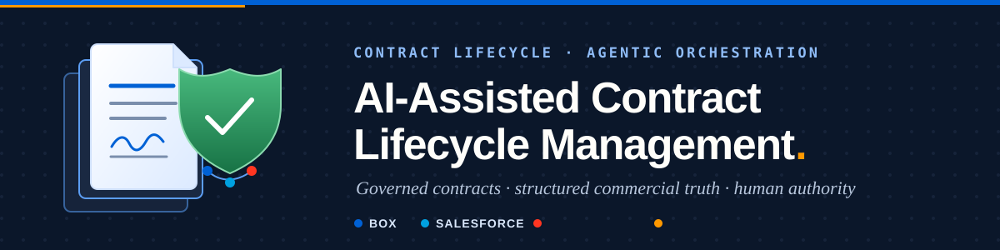

# Contract Lifecycle Management Demo

> **Presenting?** Open **[`DEMO-RUN-SHEET.html`](DEMO-RUN-SHEET.html)** — the six-beat run sheet:
> preflight checks, every prompt as copy-paste, and what each beat should return.

This repository contains a mature Contract Lifecycle Management demo with a cross-platform orchestration scenario, deterministic local fixtures, portable configuration, real-product screenshots, and self-contained presenter output.

## Choose one path

| Goal | Start here |
|---|---|
| Configure, deploy, validate, or present the demo | [Operator guide](docs/operator/README.md) |
| Understand or tailor the CLM domain, controls, agents, and value story | [Use-case creator guide](docs/use-case-creator/README.md) |
| Change code, configuration, tests, generated assets, or release state | [Maintainer guide](docs/maintainers/README.md) |

The complete persona index is in [docs/README.md](docs/README.md). AI assistants must read this file and exactly one matching persona instruction before exploring further.

## Scenarios

| Scenario | Primary surface | Coordination model |
|---|---|---|
| [Box + Salesforce Contract Lifecycle](docs/operator/scenarios/box-salesforce-clm/README.md) | Salesforce Multi-Framework React | Governed Apex actions serve an internal agent surface and a scoped counterparty workspace while humans retain decision authority. |

The scenario uses the Northstar contract package and governance model. Box remains authoritative for contract content; Salesforce `CLM_Contract__c` remains authoritative for structured commercial truth.

## Get started

Before running anything, complete operator prerequisites:

- Authenticate the CLIs used by demo setup:
  - `box login -d` (or your standard Box auth flow)
  - `sf org login web` (or org auth flow you already use)
- Confirm you are in the CLM repo root.

Run the onboarding smoke check first. It only probes CLI sessions and prints a safe, simulated install plan:

```bash
python3 scripts/setup_clm_dev.py --smoke
```

Install dependencies and create the runtime config in one command:

```bash
python3 scripts/setup_clm_dev.py
```

Useful variants:

- `--automated`: runs without prompts for CI or scripted setup.
- `--from-current-clis`: preloads Box/Salesforce IDs and login values from the authenticated CLIs into `config/runtime/demo-environment.json`.

```bash
python3 scripts/setup_clm_dev.py --automated --from-current-clis
```

Run the full non-live validation gate (unit/lint/tests/build/schema checks, local presenter artifacts, and safety contracts):

```bash
python3 scripts/validate_clm.py
```

It checks secrets and runtime-ID isolation, JSON/BCL configs, Markdown links, Mermaid/SVG drift, Python and React tests, lint, build, Playwright, deterministic fixtures, presenter output, screenshot manifests, reset behavior, and idempotency contracts. Repository mode intentionally skips live receipts.

For a live presenter-readiness decision, create the gitignored `config/runtime/validation-receipts.json` from its example and run:

```bash
python3 scripts/validate_clm.py --presenter-ready
```

This fails closed unless Box and Salesforce have current secret-free passed receipts.

## Presenter output

Start with the [presenter library](output/html/index.html). It routes to every standalone chapter and to the [complete self-contained edition](output/html/06-complete-presenter-edition.html), which embeds all seven chapters and needs no sibling files or network access. The Markdown source remains authoritative; generated HTML is the portable sharing layer.

## Source map

| Path | Purpose |
|---|---|
| `config/` | Portable platform, scenario, operator, and runtime contracts |
| `docs/use-case-creator/` | CLM architecture, agents, controls, references, value, and marketecture |
| `docs/operator/` | Ordered environment setup, deployment, validation, and presentation path |
| `docs/maintainers/` | Source precedence, development workflow, validation, and release rules |
| `docs/diagrams/` | Mermaid sources and synchronized SVG renders |
| `sample-data/` | Synthetic CLM inputs and governed clause Markdown |
| `scripts/` | Deterministic generators, operator automation, mocks, and validation |
| `tests/` | Repository, safety, fixture, presenter, and navigation checks |
| `clm-salesforce-project/` | Salesforce metadata and Multi-Framework React UI Bundle |
| `output/` | Generated fixtures, traces, screenshots, and portable presenter deliverables |

Run commands from the repository root unless a guide explicitly changes directories. Use repository-relative paths in every durable file.

## Conventions

The shared **readiness vocabulary** (how maturity is claimed) and the **safety contract** (credential, approval, and reset rules) live in [docs/conventions.md](docs/conventions.md). Follow both in any documentation, configuration, or presenter claim.
