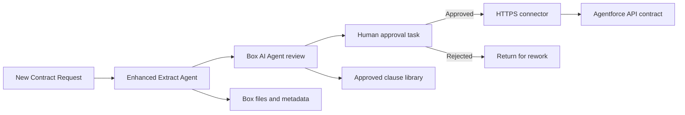
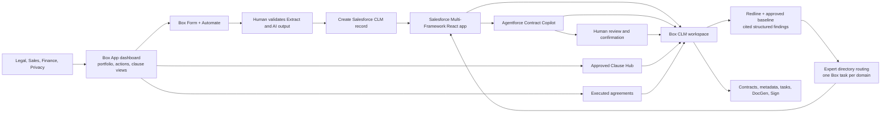

# Architecture: Box + Agentforce + React for CLM

## Design Principles

1. **One content foundation** - Box stores contract documents, signatures, metadata, versions, and audit trail for the demo.
2. **One presenter path** - The React UI Bundle, Agentforce, and live Box surfaces form a single end-to-end CLM experience.
3. **Human accountability** - AI drafts, summarizes, compares, extracts, and recommends. Humans approve legal positions, concessions, signatures, and obligations.
4. **Composable integrations** - Box remains the system of record for unstructured contract content, Salesforce remains the system of record for structured deal data, and Databricks provides governed analytics context.
5. **Reusable demo factory** - Domain-specific demos reuse the same abstraction layers, metadata conventions, agent patterns, and handoff workflow.

---

## Box Content and Automation Layer

### Box Objects

| Object | Purpose |
|--------|---------|
| `Contract Requests` folder | Intake packages from Box Forms |
| `Active Negotiations` folder | Live CLM workspaces by counterparty |
| `Executed Agreements` folder | Signed agreements with retention and renewal metadata |
| `Clause Library` folder | Approved standard clauses and fallback positions |
| `Obligation Register` folder/view | Post-signature deliverables, renewal events, notices, and owner assignments |
| `Acme Contract Clause Library` Hub | Curated publication surface for approved clause Markdown files and governance guidance |

### Metadata Templates

| Template | Scope | Example Fields |
|----------|-------|----------------|
| `clmContract` | Contract folder/package | contractId, counterparty, contractType, status, dealValue, region, owner, legalReviewer, riskLevel, renewalDate |
| `clmDocument` | Files | documentType, versionStatus, clauseRisk, aiSummaryStatus, approvalStatus, signatureStatus |
| `clmObligation` | Obligation files/records | obligationType, owner, dueDate, sourceClause, noticePeriod, status |
| `clmClause` | Individual Markdown clauses | clauseId, category, position, status, owner, reviewDate, usageCount |

### Native Automate Flow



Extract and AI outputs remain draft evidence. The approval task is the control point before the connector can invoke Salesforce standard REST. The Salesforce origin, API version, OAuth 2.0 connection, and payload mapping must be bound to the confirmed target org rather than invented for the demo.

---

## Optional Future: Custom AWS AgentCore Architecture

Rendered diagram: [CLM AgentCore Architecture](diagrams/clm-agentcore-architecture.svg)

Source: [Mermaid diagram](diagrams/clm-agentcore-architecture.mmd)

```text
┌────────────────────────────────────────────────────────────────────────────┐
│                         AWS Bedrock AgentCore                              │
│                                                                            │
│  AgentCore Strands Agents                                                │
│  ┌────────────┐ ┌────────────┐ ┌────────────┐ ┌───────────────────────┐   │
│  │ Intake     │ │ Clause     │ │ Approval   │ │ Obligation Monitor    │   │
│  │ Agent      │ │ Risk Agent │ │ Agent      │ │ Agent                 │   │
│  └─────┬──────┘ └─────┬──────┘ └─────┬──────┘ └───────────┬───────────┘   │
│        │              │              │                    │               │
│  ┌─────┴──────────────┴──────────────┴────────────────────┴────────────┐  │
│  │                 AgentCore Gateway + Strands tool layer                 │  │
│  │                     Box | Salesforce | Databricks                      │  │
│  └───────────────────────────────────────────────────────────────────────┘  │
└────────────────────────────────────────────────────────────────────────────┘
```

### System Roles

| System | Data Type | Access Pattern |
|--------|-----------|----------------|
| Box | Contracts, redlines, exhibits, signatures, clause library | MCP/API read-write with metadata and events |
| Salesforce | Opportunity, account, quote, approval state, renewal date | API read-write with event triggers |
| Databricks | Historical contract outcomes, clause analytics, spend/revenue data | SQL query via governed action groups |
| AgentCore Memory | Multi-day negotiation state, prior decisions, accepted fallback positions | Session and long-term memory |
| CloudWatch / audit store | Agent traces, tool calls, evaluation metrics | Append-only observability |

---

## Event-Driven Flow

```text
Box Form / Salesforce Opportunity Event
        │
        ▼
AgentCore Strands Intake Agent
        │
        ├──► Box: create workspace, apply metadata, collect package
        ├──► Salesforce: read opportunity, quote, account risk
        ├──► Databricks: retrieve historical clause outcomes
        │
        ▼
Clause Risk Agent
        │
        ├──► Compare redlines to playbook
        ├──► Score clause risk
        └──► Draft fallback position
        │
        ▼
Approval Agent
        │
        ├──► Route approvals to legal, privacy, security, finance
        └──► Block execution until required approvals complete
        │
        ▼
Box Sign + Obligation Monitor
```

---

## Abstraction Layers for Faster Demo Creation

| Layer | Reusable Contract | CLM Example | DAM / Vertical Swap |
|-------|-------------------|-------------|---------------------|
| Demo scenario | Persona, business object, high-stakes workflow | Commercial contract package | Asset campaign, government case file, claim, loan, portfolio review |
| Content schema | Folder template + metadata templates | Contract workspace, documents, obligations | Asset library, evidence packet, policy, loan docs |
| Experience tier | Low, medium, high demo style | Box App, coworker, AgentCore | Same three tiers |
| Agent roles | Intake, classify, risk, approve, monitor | Contract intake, clause risk, approval, obligations | Rename to domain-specific roles |
| System connectors | Content, CRM, Databricks analytics | Box, Salesforce, Databricks | Box plus domain system and Databricks analytics |
| Sample data | Synthetic PDFs + JSON records | MSA/DPA/SOW/order form | Domain-specific records and files |
| Handoff | Build state and live IDs | Box app, metadata, forms, agents | Same status doc |

---

## Failure Handling

| Scenario | Recovery Strategy |
|----------|-------------------|
| Missing contract package document | Intake agent creates task for requester and pauses downstream review |
| Low-confidence clause extraction | Escalate to legal reviewer with source page reference |
| Conflicting CRM and contract values | Block signature and route to sales operations |
| Approval timeout | Escalate to owner and update dashboard SLA status |
| Box Sign failure | Retry and create manual signature fallback task |
| Databricks unavailable | Continue Box/Salesforce review and mark analytics enrichment pending |
| Agent output conflicts with playbook | Guardrail blocks recommendation and asks for human legal review |

---

## Primary Architecture: Box + Agentforce + React

This is the presenter-facing architecture. The only runtime participants are Box, Agentforce, and the Salesforce Multi-Framework React UI Bundle. The Salesforce platform hosts the UI and Agentforce; it is not presented as a separate integration tier.

Rendered diagram: [Box + Agentforce + React architecture](diagrams/clm-box-agentforce-react.svg)

Source: [Mermaid diagram](diagrams/clm-box-agentforce-react.mmd)

Scenario flow: [Rendered demo flow](diagrams/clm-box-agentforce-react-demo-flow.svg) · [Mermaid source](diagrams/clm-box-agentforce-react-demo-flow.mmd)



### Variation rules

| Rule | Implementation |
|---|---|
| Box remains authoritative | The React client uses live Box workspace/file/task IDs and Agentforce cites Box sources. |
| Salesforce record creation is governed | Only validated intake reaches the standard REST external-ID upsert and lookup; the returned record ID becomes React and Agentforce context. |
| No browser secrets | Salesforce returns a short-lived, downscoped Box token through a same-origin endpoint. |
| Agentforce does not decide | Legal positions, approvals, and signature authorization remain human actions. |
| Routing is deterministic | Domains resolve through `config/clm/expert-routing.json`; low-confidence, unclassified, inaccessible, and unconfigured assignments go to Legal Operations triage. |
| Tasks are consolidated | The routing action creates or reuses one open task per contract, redline file, and domain. |
| Mutations are explicit | DocGen file creation requires presenter confirmation; signing stays blocked until approvals complete. |
| No external agent runtime | No request is sent to AgentCore, Strands, Databricks, or custom middleware. |

Implementation: [`clm-react-app/`](../clm-react-app/README.md)

Agent contract: [`config/agentforce/clm-react-agentforce-spec.json`](../config/agentforce/clm-react-agentforce-spec.json)

---

## Monitoring

| Signal | Target |
|--------|--------|
| Intake-to-workspace creation time | Under 2 minutes |
| Clause extraction confidence | 85%+ for standard agreements |
| Approval SLA breach rate | Under 10% |
| Time in legal review | 30-50% reduction after adoption |
| Contract cycle time | 20-40% reduction for standard commercial agreements |
| Metadata completeness | 95%+ for executed agreements |
| Obligation extraction coverage | 90%+ of signed contracts |
