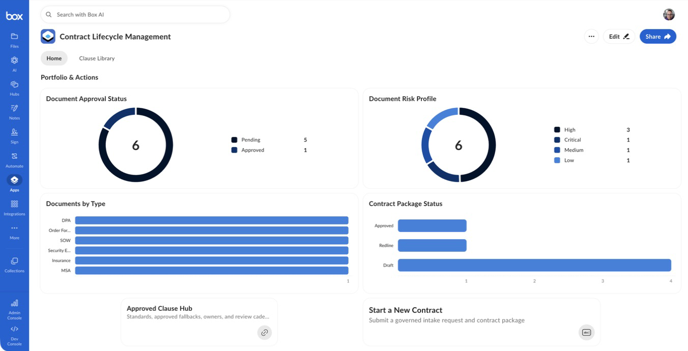
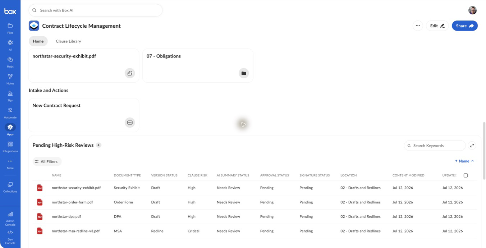
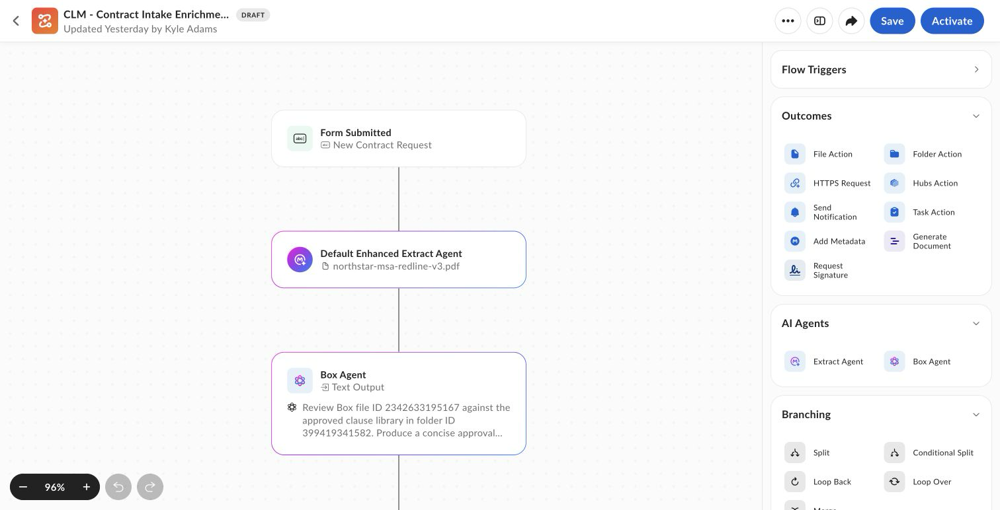
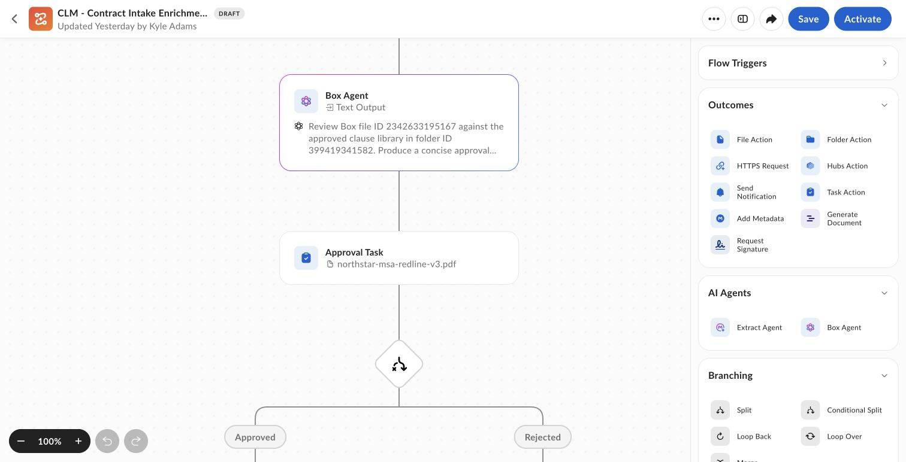
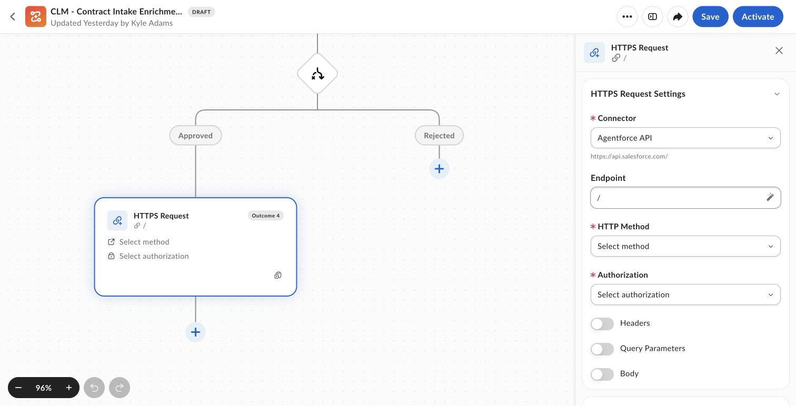
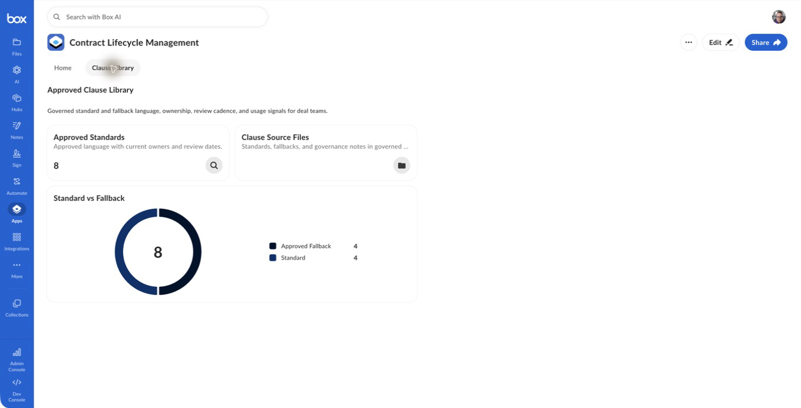
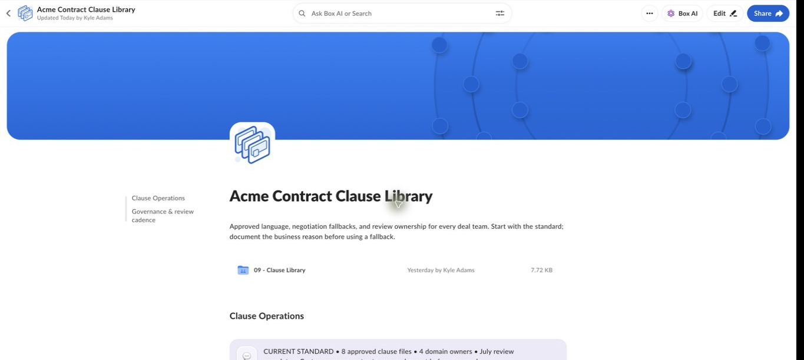
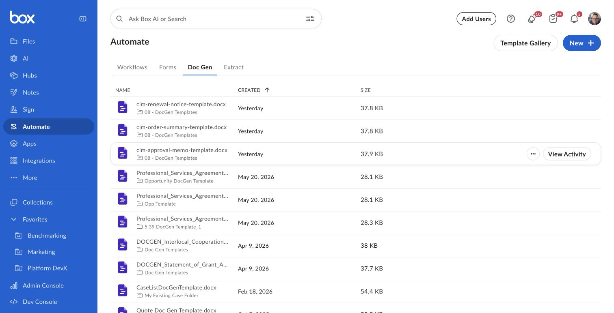

# Box Automate Agentic Orchestration

Deterministic CLM orchestration with agentic enrichment. Box is the operating surface, Box Automate controls the sequence, agents enrich evidence, named people approve decisions.

## Read this guide in order

[1. Orientation](#1-orientation) → [2. Architecture](#2-architecture) → [3. Flow](#3-flow) → [4. Presenter script](#4-presenter-script) → [5. Visual walkthrough](#5-visual-walkthrough) → [6. Components and readiness](#6-components-and-readiness) → [7. Setup and validation](#7-setup-and-validation)

Links in **References** are optional operator or technical detail.

## 1. Orientation

Use this track when Box Apps, Automate, Hubs, metadata, tasks, Doc Gen, and Sign lead; predictable routing and auditability matter more than autonomous planning; and Salesforce record creation is an integration outcome, not the presenter workspace.

| Boundary | Included |
|---|---|
| Presenter surface | Box App, Automate, Hub, metadata, tasks, Doc Gen, Sign |
| Agentic work | Extract plus Box and Agentforce agents for source-grounded enrichment |
| Structured handoff | Salesforce standard REST record creation after human approval |
| Excluded | Salesforce React, Databricks, AWS Bedrock AgentCore, Strands |

[Continue to architecture](#2-architecture)

## 2. Architecture

The Box layer owns content, workflow state, clauses, tasks, generation, signature, and audit evidence. The HTTPS Connector crosses into Salesforce only after the human validation gate.

- [Architecture source](../../../diagrams/box-automate-agentic-orchestration-architecture.mmd)
- [Shared architecture and control detail](../../../use-case-creator/architecture.md)

[Continue to flow](#3-flow)

## 3. Flow

1. Start from the Box App and use the **Start a New Contract** action to open the `01 - Intake` folder; upload the contract and apply the `clmContract` metadata to trigger intake.
2. Automate runs Extract and source-grounded agent review in a fixed sequence.
3. A named person accepts or rejects the draft evidence.
4. Only the approved branch invokes Salesforce standard REST.
5. Box tasks, metadata, Doc Gen, Sign, and the clause Hub carry the lifecycle forward.

- [Flow source](../../../diagrams/box-automate-agentic-orchestration-flow.mmd)

[Continue to presenter script](#4-presenter-script)

## 4. Presenter script

**Duration:** 12–15 minutes

**Audience:** Legal Operations, Sales Operations, security, and business sponsors

| Step | Tell | Show | Tell |
|---|---|---|---|
| 1. Portfolio | “Legal Operations needs one place to see work and act.” | Open the App; point to the three top actions and status/risk/type charts. | “The dashboard is driven by governed metadata, not a separate reporting copy.” |
| 2. Intake | “A request should be easy for Sales and controlled for Legal.” | Use the **Start a New Contract** action to open `01 - Intake`; upload the Northstar sample and apply the `clmContract` metadata. | “The file and business context enter governed Box content together.” |
| 3. Enrichment | “Automation handles the repeatable work; agents enrich evidence.” | Show the metadata trigger → workspace creation → cited Box Agent review in Automate. | “The sequence is designed, inspectable, and repeatable.” |
| 4. Control | “Agent output is a draft, not an approval.” | Show the human task and approved/rejected branches. | “Salesforce is unreachable until a named person approves.” |
| 5. Record | “Approved evidence can now update the commercial system safely.” | Show the HTTPS Connector create the Salesforce record, then open the record. | “A person, not an agent, authorized the write, and every field came from the governed submission.” |
| 6. Redlines | “Each clause issue belongs with the right domain expert.” | Open Clause Library, Hub, and domain-owned review work. | “Approved language is reusable; exceptions have a named owner and citation.” |
| 7. Execution | “Generation and signature remain controlled lifecycle events.” | Show Doc Gen templates, approval evidence, and Executed Agreements. | “People authorize generation and signature; Box retains the audit trail.” |
| 8. Close | “This is agentic orchestration directed by a governed workflow.” | Return to the portfolio view. | “Every mutation has a known stage, owner, and evidence trail.” |

Required language: agents summarize, extract, compare, and recommend; people approve legal positions and signature. Describe Automate as live only after the target environment passes OAuth and activation checks.

### What is proven, and what is not

The Box path was run end to end on 2026-07-22 and created a real Salesforce record. That proof used the **Box Form**, which has since been removed. Intake is now designed to fire from a `clmContract` metadata trigger on the `01 - Intake` folder, and that metadata-triggered variant has **not** been re-verified live — do not present it as proven until it is re-tested. Two further claims that appear elsewhere in this repository are **not** true of the live workflow, so do not make them on stage:

- **There is no Extract Agent step.** The live sequence is intake trigger, workspace copy, workspace rename, Box Agent review, approval task, conditional split, connector call. The 2026-07-22 run used a Form trigger; the current design replaces it with the `clmContract` metadata trigger. Say "agent review", not "Extract then agent review".
- **There is no duplicate protection.** The connector performs a plain record create, not an external-ID upsert, and there is no follow-up lookup. Submitting the same contract twice creates two records. Do not claim the external ID prevents duplicates.

The external-ID upsert remains the intended target design and is still described in the use-case and architecture documents. It is not what the demo currently does.

A rejected item also ends the run silently; the Rejected branch has no outcome attached. Frame step 4 as "Salesforce is unreachable until approval" rather than promising a return-for-correction path.

[Continue to the visual walkthrough](#5-visual-walkthrough)

## 5. Visual walkthrough

Canonical Box screenshots; Cross-Platform Agentic Orchestration references these same files.

### Portfolio and actions

### Intake and deterministic automation

Intake starts when a contract is uploaded to the `01 - Intake` folder and the `clmContract` metadata template is applied to it. Applying that metadata triggers **CLM - Contract Intake Enrichment**. (The earlier Box Form intake screenshot was removed with the Form; a metadata-intake capture can be added after the metadata-triggered workflow is re-verified live.)

### Clauses and generation

Optional offline presentation: [self-contained visual gallery](../../../../output/html/02-box-automate-agentic-orchestration-gallery.html). For the complete narrative, use the [portable guide](../../../../output/html/01-box-automate-agentic-orchestration-guide.html).

[Continue to components and readiness](#6-components-and-readiness)

## 6. Components and readiness

| Component | Role | Status |
|---|---|---|
| Box App | Portfolio and single intake entry (Start a New Contract folder action) | Must be built and published per environment |
| Box Automate | Metadata trigger → workspace copy and rename → Box Agent review → approval → connector | Form-triggered variant proven 2026-07-22; metadata trigger not yet re-verified live |
| Extract and Box/Agentforce agents | Structured evidence and source-grounded recommendations | **Portable specification** |
| HTTPS Connector | Salesforce standard REST record creation | Configured and proven; connector must target the org holding `CLM_Contract__c` |
| Metadata, tasks, Clause Hub | Status, risk, named ownership, approved positions | Foundation automated; browser seeding remains |
| Box Doc Gen | Approval memo, order summary, renewal notice | Templates generated/uploaded; mark in Box UI |
| Box Sign | Human-authorized execution | Configure only after approval controls pass |

[Continue to setup and validation](#7-setup-and-validation)

## 7. Setup and validation

1. Complete [Operator Start Here](../../start-here.md) for the target environment.
2. Open the App and Hub URLs stored in the local runtime config.
3. Confirm the App has the Start a New Contract folder action (pointing at `01 - Intake`), the Clause Hub action, and Executed Agreements action.
4. Confirm Automate remains inactive unless the owner explicitly authorizes activation.
5. Confirm Extract, cited agent review, human approval, and connector stages match the flow above.
6. Confirm review tasks remain human-owned and signature stays blocked while required work is incomplete.
7. Rebuild the offline gallery with `python3 scripts/build_clm_experience_gallery.py` after replacing a screenshot.

### References

- [Operator setup and activation](../../start-here.md)
- [Manual-task register](../../manual-task-register.md)
- [Machine-readable scenario manifest](../../../../config/demo/box-automate-agentic-orchestration-demo-manifest.bcl)
- [Box App blueprint](../../../../config/box/box-app-blueprint.md)
- [`clmContract` metadata template](../../../../config/box/metadata-templates.bcl)

[Back to the scenario selector](../README.md)
