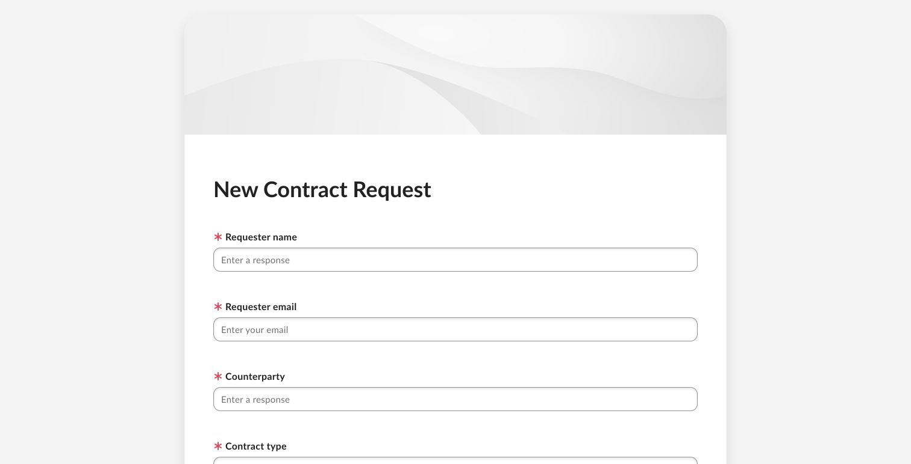

# Box Automate Agentic Orchestration

Deterministic CLM orchestration with agentic enrichment. Box is the operating surface, Box Automate controls the sequence, agents enrich evidence, and named people approve decisions.

## Read this guide in order

[1. Orientation](#1-orientation) → [2. Architecture](#2-architecture) → [3. Flow](#3-flow) → [4. Presenter script](#4-presenter-script) → [5. Visual walkthrough](#5-visual-walkthrough) → [6. Components and readiness](#6-components-and-readiness) → [7. Setup and validation](#7-setup-and-validation)

Everything required for the main presentation is on this page. Links in **References** are optional operator or technical detail.

## 1. Orientation

Use this track when Box Apps, Forms, Automate, Hubs, metadata, tasks, Doc Gen, and Sign should lead; predictable routing and auditability matter more than autonomous planning; and Salesforce record creation is an integration outcome rather than the presenter workspace.

| Boundary | Included |
|---|---|
| Presenter surface | Box App, Form, Automate, Hub, tasks, Doc Gen, Sign |
| Agentic work | Extract plus Box and Agentforce agents for source-grounded enrichment |
| Structured handoff | Salesforce standard REST external-ID upsert and lookup after human approval |
| Excluded | Salesforce React, Databricks, AWS Bedrock AgentCore, Strands |

[Continue to architecture](#2-architecture)

## 2. Architecture

The Box layer owns content, workflow state, clauses, tasks, generation, signature, and audit evidence. The HTTPS Connector crosses into Salesforce only after the human validation gate.

- [Architecture source](../../../diagrams/box-automate-agentic-orchestration-architecture.mmd)
- [Shared architecture and control detail](../../../use-case-creator/architecture.md)

[Continue to flow](#3-flow)

## 3. Flow

1. Start from the Box App and open the single contract-intake Form.
2. Automate runs Extract and source-grounded agent review in a fixed sequence.
3. A named person accepts or rejects the draft evidence.
4. Only the approved branch invokes Salesforce standard REST.
5. Box tasks, metadata, Doc Gen, Sign, and the clause Hub carry the lifecycle forward.

- [Flow source](../../../diagrams/box-automate-agentic-orchestration-flow.mmd)

[Continue to presenter script](#4-presenter-script)

## 4. Presenter script

**Duration:** 12–15 minutes

**Audience:** Legal Operations, Sales Operations, security, and business sponsors

| Step | Tell | Show | Tell |
|---|---|---|---|
| 1. Portfolio | “Legal Operations needs one place to see work and act.” | Open the App; point to the three top actions and status/risk/type charts. | “The dashboard is driven by governed metadata, not a separate reporting copy.” |
| 2. Intake | “A request should be easy for Sales and controlled for Legal.” | Open the sole **Start a New Contract** Form and submit the Northstar sample. | “The file and business context enter governed Box content together.” |
| 3. Enrichment | “Automation handles the repeatable work; agents enrich evidence.” | Show Form → Extract → cited agent review in Automate. | “The sequence is designed, inspectable, and repeatable.” |
| 4. Control | “Agent output is a draft, not an approval.” | Show the human task and approved/rejected branches. | “Rejected work returns for correction; Salesforce is unreachable until approval.” |
| 5. Record | “Approved evidence can now update the commercial system safely.” | Show the HTTPS Connector upsert and lookup result. | “The external ID prevents duplicates, and a person—not an agent—authorized the write.” |
| 6. Redlines | “Each clause issue belongs with the right domain expert.” | Open Clause Library, Hub, and domain-owned review work. | “Approved language is reusable; exceptions have a named owner and citation.” |
| 7. Execution | “Generation and signature remain controlled lifecycle events.” | Show Doc Gen templates, approval evidence, and Executed Agreements. | “People authorize generation and signature; Box retains the audit trail.” |
| 8. Close | “This is agentic orchestration directed by a governed workflow.” | Return to the portfolio view. | “Every mutation has a known stage, owner, and evidence trail.” |

Required language: agents summarize, extract, compare, and recommend; people approve legal positions and signature. Describe Automate as live only after the target environment passes OAuth, idempotency, and activation checks.

[Continue to the visual walkthrough](#5-visual-walkthrough)

## 5. Visual walkthrough

These are the canonical Box screenshots. Cross-Platform Agentic Orchestration references the same files rather than copying them.

### Portfolio and actions

### Intake and deterministic automation

### Clauses and generation

Optional offline presentation: [self-contained visual gallery](../../../../output/html/02-box-automate-agentic-orchestration-gallery.html). For the complete narrative, use the [portable guide](../../../../output/html/01-box-automate-agentic-orchestration-guide.html).

[Continue to components and readiness](#6-components-and-readiness)

## 6. Components and readiness

| Component | Role | Status |
|---|---|---|
| Box App and Form | Portfolio and single intake entry | Must be built and published per environment |
| Box Automate | Form → Extract → agent review → approval → connector | Must pass inactive smoke test before activation |
| Extract and Box/Agentforce agents | Structured evidence and source-grounded recommendations | **Portable specification** |
| HTTPS Connector | Salesforce external-ID upsert and lookup | Must be configured and tested per environment |
| Metadata, tasks, Clause Hub | Status, risk, named ownership, approved positions | Foundation automated; browser seeding remains |
| Box Doc Gen | Approval memo, order summary, renewal notice | Templates generated/uploaded; mark in Box UI |
| Box Sign | Human-authorized execution | Configure only after approval controls pass |

[Continue to setup and validation](#7-setup-and-validation)

## 7. Setup and validation

1. Complete [Operator Start Here](../../start-here.md) for the target environment.
2. Open the App, Form, and Hub URLs stored in the local runtime config.
3. Confirm the App has one intake Form, the Clause Hub action, and Executed Agreements action.
4. Confirm Automate remains inactive unless the owner explicitly authorizes activation.
5. Confirm Extract, cited agent review, human approval, and connector stages match the flow above.
6. Confirm review tasks remain human-owned and signature stays blocked while required work is incomplete.
7. Rebuild the offline gallery with `python3 scripts/build_clm_experience_gallery.py` after replacing a screenshot.

### References

- [Operator setup and activation](../../start-here.md)
- [Manual-task register](../../manual-task-register.md)
- [Machine-readable scenario manifest](../../../../config/demo/box-automate-agentic-orchestration-demo-manifest.json)
- [Box Form blueprint](../../../../config/box/form-blueprint.md)
- [Box App blueprint](../../../../config/box/box-app-blueprint.md)

[Back to the scenario selector](../README.md)
