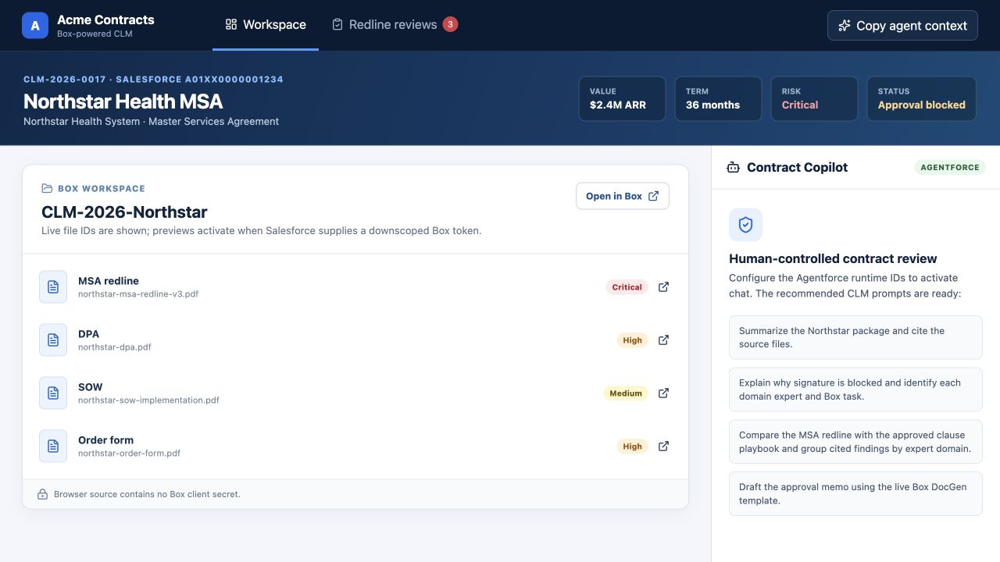

# Box + Salesforce Contract Lifecycle

Contract work governed across two platforms. Box is authoritative for content; Salesforce
is authoritative for structured commercial truth. A set of governed Apex actions is the
only path between them, and the same actions serve two very different audiences — an
internal agent surface and a counterparty workspace scoped to one folder.

## Read this guide in order

[1. Orientation](#1-orientation) → [2. Architecture](#2-architecture) → [3. Flow](#3-flow) → [4. Presenter script](#4-presenter-script) → [5. Visual walkthrough](#5-visual-walkthrough) → [6. Components and readiness](#6-components-and-readiness) → [7. Setup and validation](#7-setup-and-validation)

Links in **References** and the supporting React scripts are optional technical depth.

## 1. Orientation

Use this track when the question is *governance* — who may read what, who decides, and what
an agent is allowed to do on someone else's behalf.

| Boundary | Included |
|---|---|
| Internal surface | MCP server read through Claude Desktop; Agentforce Contract Copilot |
| Counterparty surface | Salesforce Experience Cloud site running the React UI bundle |
| Systems | Box, Salesforce |
| Shared asset | Box Automate intake exists as the entry-point path |
| Human authority | Legal positions, approvals, concessions, signature |

Box content and the React workspace run live against a real folder. Each operator
configures their own Box app, Salesforce org and Agentforce agent.

[Continue to architecture](#2-architecture)

## 2. Architecture

Every read of contract content goes through Apex. That is what lets one implementation
serve both audiences: the Box credential never leaves the org, so an MCP client holds no
Box token and a counterparty's browser holds a token scoped to a single folder.

- [Architecture source](../../../diagrams/clm-architecture.mmd)
- [Shared architecture and control detail](../../../use-case-creator/architecture.md)

### Governed actions

| Action | Responsibility |
|---|---|
| Contract package | Resolves a contract from a reference, name or record id; lists its documents with Box file ids |
| Ask a document | Box AI over one file, refused unless that file belongs to the named contract |
| Generate counter-position | Box Doc Gen from a template the org owns, not one the caller chooses |
| Send for signature | Box Sign — refuses unless the contract is approved and the document belongs to it |
| Downscoped token | One folder, short-lived, minted per record for the workspace |

[Continue to flow](#3-flow)

## 3. Flow

1. A contract arrives on the customer's paper and lands in a governed Box folder.
2. The internal reader asks what is in it and how it compares to approved positions.
3. Findings cite Box files; the approved clause library is the reference, not the model.
4. Precedent comes from what this counterparty actually signed before.
5. A counter-position memo is generated into the folder; signature is refused until approved.
6. The counterparty opens the same platform, scoped to their own contracts and filtered content.

- [Flow source](../../../diagrams/box-salesforce-clm-flow.mmd)

[Continue to presenter script](#4-presenter-script)

## 4. Presenter script

**Duration:** 5–6 minutes for the executive path; see the
[supporting React scripts](supporting-react-scripts/README.md) for the longer variants.

| Step | Tell | Show | Tell |
|---|---|---|---|
| 1. Their paper | "The document being negotiated is the customer's, not ours." | The governed folder and the customer-paper draft. | "There is no template to diff against." |
| 2. Risk | "The portfolio already knows what is risky." | A metadata search returning critical-risk documents across contracts. | "One query, not a folder walk." |
| 3. Positions | "Read it against the approved library." | Cited exposure with clause ids and the approved fallback. | "A keyword search finds nothing — the phrase is absent." |
| 4. Precedent | "What did they agree the last two times?" | The prior executed agreements' negotiated position. | "Course of dealing is what moves a negotiation." |
| 5. Boundary | "Put the position on paper, then stop." | The generated memo, then signature refused. | "The refusal is a state check in Apex, not a prompt instruction." |
| 6. Other side | "Same platform, scoped to the counterparty." | The counterparty's workspace: their contracts only, redlines withheld. | "Enforced by a sharing set and a downscoped token." |

Required language: Box governs content; Salesforce governs commercial truth; agents
retrieve, compare, explain and draft; humans approve concessions and signatures.

[Continue to the visual walkthrough](#5-visual-walkthrough)

## 5. Visual walkthrough

Box screenshots below come from the shared Box surface capture set; the React screenshots
are workspace-specific.

### Unified React workspace

### Shared governed Box context

Optional offline presentation: [self-contained visual gallery](../../../../output/html/02-box-salesforce-clm-gallery.html).
For the complete narrative, use the [portable guide](../../../../output/html/01-box-salesforce-clm-guide.html).

[Continue to components and readiness](#6-components-and-readiness)

## 6. Components and readiness

| Layer | Components | Status |
|---|---|---|
| Experience | Salesforce Experience Cloud site + React UI bundle | **Deployed integration**; verified against live Box |
| Salesforce | `CLM_Contract__c`, governed Apex actions, sharing set, permission sets | **Deployed integration** |
| Box | Content, metadata templates, Hub, Doc Gen, Sign | **Deployed integration** for content, Doc Gen and Sign preparation |
| Internal agents | MCP server; Agentforce Contract Copilot | **Deployed integration**; configure per environment |
| Controls | Citations, scoped reads, human approvals, signature block | **Deployed integration** |

### Component and authority contract

- Box governs the contract package, versions, metadata, the approved clause library Hub,
  Doc Gen, Sign, and audit history.
- Salesforce `CLM_Contract__c` governs structured commercial context and Box references.
- Salesforce intake is designed around a `Contract_ID__c` external-ID upsert followed by
  lookup so retries cannot create duplicate records. The live Box Automate workflow
  currently performs a plain record create instead, which is not idempotent; restore the
  upsert before making a duplicate-safety claim.
- Agents may retrieve, summarize, compare, explain, recommend, draft, and route. They
  cannot approve a legal position or authorize signature.
- **The counterparty surface carries no agent.** A Service Agent runs as its own user, not
  the person signed in, so nothing scoping the page reaches it. See the handoff for why.
- Low-confidence, unclassified, missing-owner, and inaccessible work routes to Legal
  Operations triage.

[Continue to setup and validation](#7-setup-and-validation)

## 7. Setup and validation

1. Complete [Operator Start Here](../../start-here.md) and the Box surface foundation first.
2. Complete [Box Preview Setup](../../box-preview-setup.md) so the workspace reaches live
   Box content.
3. Start the React workspace with this environment's Salesforce record ID, contract ID, and
   generated Box workspace folder ID.
4. Confirm the governed folder renders, a document previews, and no browser secret is
   present.
5. Confirm every finding carries a Box citation and every approval remains human-owned.
6. Confirm signature is refused on a contract that is not approved.
7. Sign in to the site as the counterparty user and confirm they see only their own
   contracts, with redlines withheld.

### Guardrail checks

| Attempt | Required result |
|---|---|
| Request signature before approvals | Refused by a state check in Apex, naming the status |
| Ask a document that belongs to another contract | Refused, whatever reference was supplied |
| Return a material legal position without a Box citation | Block and request source evidence |
| Open the counterparty workspace for another account's contract | No records returned |

### References

- [Operator setup and activation](../../start-here.md)
- [Cross-platform deployment](../../start-here.md)
- [Manual-task register](../../manual-task-register.md)
- [Salesforce record contract](../../../use-case-creator/salesforce-record-contract.md)
- [Machine-readable scenario manifest](../../../../config/demo/box-salesforce-clm-demo-manifest.bcl)
- [Supporting React scripts](supporting-react-scripts/README.md)

[Back to the operator run order](../../README.md)
