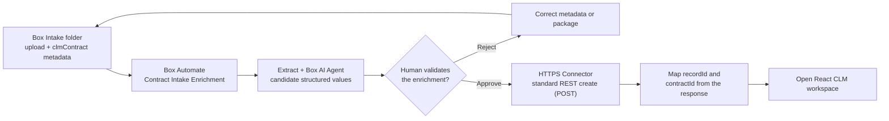

# Entry-Point Variation: Box Metadata Trigger to Salesforce Record

Use this 5–7 minute module in place of the pre-created-record opening in any CLM walkthrough. The rest of the demo continues in the same Salesforce Multi-Framework React workspace.

> **Proven vs. designed.** The end-to-end intake was proven live on 2026-07-22 when it was triggered by a Box Form. The Form has since been removed and the workflow re-designed around a `clmContract` metadata trigger. That metadata-triggered variant has not yet been re-verified live; rehearse it against a labeled test before presenting.

## Outcome

A contract is uploaded to the `01 - Intake` folder and the `clmContract` metadata template is applied to it. Applying that metadata triggers **CLM - Contract Intake Enrichment**, which runs Extract and the Box AI Agent; a human validates the proposed values, and the approved branch calls the HTTPS Connector. Salesforce creates one `CLM_Contract__c` record and returns the context needed to open React.



Rendered version: [Box metadata entry-point flow](../../../../diagrams/clm-box-form-automate-entry.svg).

## Live anchors

| Surface | Value |
|---|---|
| Intake folder | Generated `01 - Intake` folder |
| Metadata template | `clmContract`, applied to the uploaded contract to trigger the workflow |
| Saved workflow | Target environment's **CLM - Contract Intake Enrichment** |
| Connector operation | `salesforceContractCreate` (POST create) |
| Salesforce API | Standard sObject collection REST resource |
| Salesforce object | `CLM_Contract__c` |

Treat the workflow as inactive until the target environment's Salesforce object, origin, API version, OAuth connection, standard REST operation, and integrated smoke test are complete.

## Pre-demo setup

1. Complete [Operator Start Here](../../../start-here.md) and the integrated smoke test.
2. Use a clearly labeled non-production contract and a unique `contractId`.
3. Confirm the workflow triggers on `clmContract` metadata applied in the generated `01 - Intake` folder.
4. Confirm the HTTPS Connector points to the intended Salesforce test org and uses an administrator-managed OAuth 2.0 connection.
5. Have the Salesforce CLM record list and React launch page open in separate tabs.
6. Obtain explicit confirmation immediately before activating the Box Automate workflow.

## Intake metadata values

Upload the Northstar contract package to `01 - Intake`, then apply the `clmContract` metadata template with these values. The four Salesforce-required fields (`contractId`, `contractType`, `counterparty`, `requesterEmail`) must be populated before the trigger fires, or Box sends the literal `Variable unavailable` into a typed Salesforce field.

| Metadata field | Demo value |
|---|---|
| contractId | A unique labeled test ID |
| counterparty | `Northstar Health System` |
| requesterEmail | `jordan.lee@acmerobotics.example` |
| contractType | `MSA Package` |
| dealValue | `2400000` |
| region | `US` |
| dataCategory | `PHI` |
| targetSignatureDate | `2026-07-31` |
| owner | `Account Executive` |

## Presenter script

### 1. Apply intake metadata

Upload the contract package to the `01 - Intake` folder, then apply the `clmContract` metadata template with the values above.

**Say**

> The process begins where the requester already works. Box captures the contract package and its structured metadata together, so the workflow starts with governed content rather than a detached CRM record. Applying the metadata is what starts the pipeline.

Verify that the upload appears in the generated intake folder and record the created Box intake file ID.

### 2. Show Automate enrichment

Open the workflow run and show these stages:

1. **Enhanced Extract Agent** proposes structured contract fields.
2. **Box AI Agent** produces a cited risk and approval brief.
3. **Approval Task** pauses processing for human validation.

Do not claim that extracted or AI-generated values are authoritative before the approval task is completed.

### 3. Validate the human gate

Inspect the proposed values and citations. Correct or reject unsupported values. For the demo, approve only after confirming the counterparty, contract type, value, region, data category, signature date, business owner, Box item references, and `contractId`.

**Say**

> Automate can prepare the record, but it cannot silently promote unreviewed AI output into Salesforce. A person validates the payload before the connector is allowed to run.

### 4. Show the HTTPS Connector handoff

> **Match this to the workflow you actually run.** The proven live connector is `salesforceContractCreate`, a plain **POST** to `services/data/{apiVersion}/sobjects/CLM_Contract__c` (`config/box/https-connectors.bcl`). Its dynamic values now bind to `static.trigger.metadata.<key>` instead of Form fields. It is **not idempotent** — re-triggering the same contract creates a second record. Do not claim duplicate-safe upsert on stage unless the org you are demoing actually runs the `salesforceContractUpsert` PATCH path below, which remains the duplicate-safe design target rather than the proven path.

On the approved branch, show the connector calling Salesforce. The proven path posts a new record:

```text
POST services/data/{apiVersion}/sobjects/CLM_Contract__c
```

The duplicate-safe design target instead upserts against the external-ID resource:

```text
PATCH /services/data/{apiVersion}/sobjects/CLM_Contract__c/Contract_ID__c/{urlEncodedContractId}
```

The request contains only the allowlisted structured fields. It must not contain contract bytes, Box access tokens, connector secrets, signer identity details, or unreviewed AI output.

The POST create returns the new record `id`. With the PATCH upsert design, a retry with the same `contractId` would update the existing record instead of creating a duplicate.

### 5. Open the resulting workspace

Confirm the successful response returns the created record `id`:

```json
{
  "id": "<salesforce-record-id>"
}
```

Open React with the Salesforce record context plus the Box folder ID gathered from the upstream workflow:

```text
recordId=<salesforce-record-id>&contractId=<contract-id>&folderId=<generated-workspace-folder-id>
```

Then continue with Act 1 of the selected executive, Legal Operations, or technical walkthrough.

## Pass criteria

- Applying `clmContract` metadata in the intake folder starts the workflow.
- Extract and the Box AI Agent complete before the human approval gate.
- Rejection does not call Salesforce.
- Approval calls only the configured standard REST create operation through the HTTPS Connector.
- Salesforce creates exactly one `CLM_Contract__c` record for the `contractId`.
- The response supplies the created record `id`.
- React opens with the returned Salesforce record and authoritative Box workspace context.
- Contract documents remain in Box.

## Reset

1. Record the triggering file ID, workflow run ID, and Salesforce record ID.
2. Disable the workflow after the rehearsal if it should not remain active.
3. Delete only the clearly labeled test Salesforce record if the org reset policy permits it.
4. Preserve the Box content and workflow history when audit evidence is part of the demonstration.
