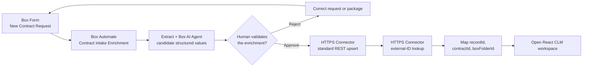

# Entry-Point Variation: Box Form to Salesforce Record

Use this 5–7 minute module in place of the pre-created-record opening in any CLM walkthrough. The rest of the demo continues in the same Salesforce Multi-Framework React workspace.

## Outcome

A requester submits **New Contract Request** in Box. **CLM - Contract Intake Enrichment** runs Extract and the Box AI Agent, a human validates the proposed values, and the approved branch calls the HTTPS Connector. Salesforce upserts one `CLM_Contract__c` record and returns the context needed to open React.



Rendered version: [Box Form entry-point flow](../../../../diagrams/clm-box-form-automate-entry.svg).

## Live anchors

| Surface | Value |
|---|---|
| Published Form | Target environment's **New Contract Request** URL |
| Intake folder | Generated `01 - Intake` folder |
| Saved workflow | Target environment's **CLM - Contract Intake Enrichment** |
| Connector operations | `salesforceContractUpsert`, then `salesforceContractLookup` |
| Salesforce API | Standard sObject Rows by External ID REST resource |
| Salesforce object | `CLM_Contract__c` |

Treat the workflow as inactive until the target environment's Salesforce object, origin, API version, OAuth connection, standard REST operations, and integrated smoke test are complete.

## Pre-demo setup

1. Complete [Operator Start Here](../../../start-here.md) and the integrated smoke test.
2. Use a clearly labeled non-production request and a unique `contractId`.
3. Confirm the workflow targets the published Form and generated intake folder.
4. Confirm the HTTPS Connector points to the intended Salesforce test org and uses an administrator-managed OAuth 2.0 connection.
5. Have the Salesforce CLM record list and React launch page open in separate tabs.
6. Obtain explicit confirmation immediately before activating the Box Automate workflow.

## Form values

| Field | Demo value |
|---|---|
| Requester name | `Jordan Lee` |
| Requester email | `jordan.lee@acmerobotics.example` |
| Counterparty | `Northstar Health System` |
| Contract type | `MSA Package` |
| Deal value | `2400000` |
| Region | `US` |
| Data category | `PHI` |
| Target signature date | `2026-07-31` |
| Business owner | `Account Executive` |
| Upload contract package | Northstar contract package |
| Special terms / risk notes | `Customer redlines liability, renewal, payment, and PHI terms.` |

## Presenter script

### 1. Submit the request

Open the published Form, enter the demo values, upload the contract package, and submit.

**Say**

> The process begins where the requester already works. Box captures the request and contract package together, so the workflow starts with governed content rather than a detached CRM record.

Verify that the submission appears in the generated intake folder and record the created Box intake file ID.

### 2. Show Automate enrichment

Open the workflow run and show these stages:

1. **Enhanced Extract Agent** proposes structured contract fields.
2. **Box AI Agent** produces a cited risk and approval brief.
3. **Approval Task** pauses processing for human validation.

Do not claim that extracted or AI-generated values are authoritative before the approval task is completed.

### 3. Validate the human gate

Inspect the proposed values and citations. Correct or reject unsupported values. For the demo, approve only after confirming the counterparty, contract type, value, region, data category, signature date, business owner, Box item references, and generated `contractId`.

**Say**

> Automate can prepare the record, but it cannot silently promote unreviewed AI output into Salesforce. A person validates the payload before the connector is allowed to run.

### 4. Show the HTTPS Connector handoff

On the approved branch, show `salesforceContractUpsert` calling Salesforce's standard external-ID resource:

```text
PATCH /services/data/{apiVersion}/sobjects/CLM_Contract__c/Contract_ID__c/{urlEncodedContractId}
```

The request contains only the allowlisted structured fields. It must not contain contract bytes, Box access tokens, connector secrets, signer identity details, or unreviewed AI output.

Salesforce upserts by `Contract_ID__c`. A retry with the same `contractId` updates the existing record instead of creating a duplicate.

Because an update can return no response body, the next step, `salesforceContractLookup`, retrieves stable launch context:

```text
GET /services/data/{apiVersion}/sobjects/CLM_Contract__c/Contract_ID__c/{urlEncodedContractId}?fields=Id,Contract_ID__c,Box_Workspace_Folder_ID__c
```

No custom Apex intake service or SOQL query is required.

### 5. Open the resulting workspace

Confirm the successful response includes:

```json
{
  "recordId": "<salesforce-record-id>",
  "contractId": "<contract-id>",
  "boxFolderId": "<generated-workspace-folder-id>"
}
```

Open React with:

```text
recordId=<salesforce-record-id>&contractId=<contract-id>&folderId=<generated-workspace-folder-id>
```

Then continue with Act 1 of the selected executive, Legal Operations, or technical walkthrough.

## Pass criteria

- The Form submission lands in the intended Box intake folder.
- Extract and the Box AI Agent complete before the human approval gate.
- Rejection does not call Salesforce.
- Approval calls only the configured standard REST upsert and lookup operations through the HTTPS Connector.
- Salesforce creates or reuses exactly one `CLM_Contract__c` record for the `contractId`.
- The response supplies `recordId`, `contractId`, and `boxFolderId`.
- React opens with the returned Salesforce record and authoritative Box workspace context.
- Contract documents remain in Box.

## Reset

1. Record the Form submission, workflow run ID, intake file ID, and Salesforce record ID.
2. Disable the workflow after the rehearsal if it should not remain active.
3. Delete only the clearly labeled test Salesforce record if the org reset policy permits it.
4. Preserve the Box request and workflow history when audit evidence is part of the demonstration.
