# CLM Demo Operator Start Here

Use this guide to build the demo in a **new Box enterprise and Salesforce org**. Do not copy IDs, URLs, users, or credentials from another environment.

## What the automation does

| Automated | Administrator or browser work |
|---|---|
| Generate synthetic contracts and Doc Gen templates | Confirm product licenses and administrator access |
| Create the Box workspace folders | Build Box App, Hub, and Automate workflows |
| Create Box metadata templates and apply deterministic dashboard seed data | Select real reviewers and verify seeded values |
| Upload the contract package and Doc Gen templates | Configure protected OAuth credentials |
| Deploy the Salesforce object, fields, layout, permissions, tab, and UI Bundle | Create/configure Agentforce and optional cloud services |
| Validate required local environment bindings | Publish, share, activate, generate, or send only with owner approval |

The generated IDs are stored only in `config/runtime/bootstrap-state.json`. The operator's URLs and environment settings are stored only in `config/runtime/demo-environment.json`. Both files are ignored by Git. The Box bootstrap checkpoints after each successful create/upload, so rerunning it skips recorded resources instead of duplicating them.

## 1. Choose a scenario

- **Box Automate Agentic Orchestration:** Box-led, predictable Automate stages with agentic enrichment and human approval.
- **Cross-Platform Agentic Orchestration:** Salesforce React workspace with AgentCore/Strands specialist delegation, Agentforce, Box, and Databricks.

Build and rehearse **Box Automate Agentic Orchestration first**; it is the foundation for both scenarios.

## 2. Confirm prerequisites

- Python 3.10+, Node.js/npm, Mermaid CLI (`mmdc`), [Box CLI](https://developer.box.com/guides/tooling/cli/), and [Salesforce CLI](https://developer.salesforce.com/tools/salesforcecli).
- A Box enterprise with Apps, Forms, Automate, Extract/AI, Hubs, Doc Gen, Sign, metadata, and tasks enabled for the operator.
- A Salesforce org with permission to deploy metadata, create an integration user, configure an External Client App, and use Agentforce/UI Bundles where applicable.
- Named Box, Salesforce, workflow, legal, privacy, security, and finance owners.

Have the administrators confirm the required Box and Salesforce product licenses and permissions before setup. Do not infer entitlements from a successful CLI login.

Do not place client secrets, access tokens, private keys, or passwords in this repository.

Install dependencies and seed runtime config in one step:

```bash
python3 scripts/setup_clm_dev.py
```

Non-interactive:

```bash
python3 scripts/setup_clm_dev.py --automated
```

Pull Box and Salesforce values from your logged-in CLIs:

```bash
python3 scripts/setup_clm_dev.py --automated --from-current-clis
```

Non-invasive onboarding check:

```bash
python3 scripts/setup_clm_dev.py --smoke
```

## 3. Create local configuration

From the repository root:

```bash
cp config/runtime/demo-environment.example.json config/runtime/demo-environment.json
```

If already authenticated to Box and Salesforce, auto-fill from CLIs:

```bash
python3 scripts/setup_clm_dev.py --automated --from-current-clis --pet off
```

Otherwise fill only initial values first:

- `box.parentFolderId`: the Box folder under which the demo may be created; use `0` only when the operator's root is appropriate.
- `box.enterpriseId`: copy the authenticated enterprise ID from the Box administrator.
- `box.operatorLogin`: the exact login returned by `box users:get me --json`.
- `box.reviewerLogins`: at least one real collaborator who will own demo validation tasks.
- `box.allowRootFolder`: leave `false`; set it to `true` only when the owner explicitly approves creating the demo at Box root.
- `box.hostname`: your enterprise hostname, for example `example.ent.box.com`.
- `salesforce.orgAlias`: the alias used by the Salesforce CLI.
- `salesforce.orgId`: copy the exact org ID shown by `sf org display`; deployment refuses a mismatch.
- `salesforce.myDomainUrl`: your org's My Domain URL.
- `salesforce.integrationUsername` and `integrationEmail`: the dedicated API-only user's unique username and administrator contact email.

Leave generated IDs out of this file. Leave optional Agentforce, AgentCore, and Databricks values blank until those services are configured.

Authenticate the CLIs. For interactive operator access:

```bash
box login -d
sf org login web --alias <your-clm-org-alias>
sf org display --target-org <your-clm-org-alias>
```

If your organization requires a Box JWT or client-credentials application, have the Box administrator configure it from a secret file stored **outside** this repository, then select that CLI environment. Confirm the authenticated Box user can create folders and enterprise metadata templates.

Then run:

```bash
python3 scripts/demo_operator.py doctor
```

Most common path after config seeding:

```bash
python3 scripts/demo_operator.py bootstrap --scenario box-automate-agentic-orchestration --dry-run
```

When approvals are confirmed:

```bash
python3 scripts/demo_operator.py bootstrap --scenario box-automate-agentic-orchestration --yes
```

The one-shot `bootstrap` command always checks pre-requisites, avoids duplicates, and only creates missing resources.

Expected: preview makes no external writes; confirmed apply prints phase-by-phase status lines and a completion summary.

Standalone doctor check (expected: `Doctor passed`):

```bash
python3 scripts/demo_operator.py doctor
```

When Box and Salesforce administration is split between people, each can run a scoped preflight:

```bash
python3 scripts/demo_operator.py doctor --platform box
python3 scripts/demo_operator.py doctor --platform salesforce
```

## 4. Generate and create the reusable foundation

Preview without changing either environment:

```bash
python3 scripts/demo_operator.py generate-assets --dry-run
python3 scripts/demo_operator.py box-foundation --dry-run
python3 scripts/demo_operator.py seed-metadata --dry-run
python3 scripts/demo_operator.py salesforce-deploy --dry-run
```

Then apply the approved phases:

```bash
python3 scripts/demo_operator.py generate-assets
python3 scripts/demo_operator.py box-foundation
python3 scripts/demo_operator.py seed-metadata
python3 scripts/demo_operator.py salesforce-deploy
python3 scripts/demo_operator.py resolve-config --allow-unresolved
```

The Box phases create the Northstar folder hierarchy, all five metadata templates, upload six synthetic contract documents, upload three Doc Gen templates, seed the approved-clause Markdown library, and apply deterministic metadata that populates the App charts. They do not publish or share anything.

The Salesforce phase deploys the portable CLM data model and UI, including the CLM Lightning record page with its Box tab. It assigns the required CLM and managed Box permission sets to the authenticated administrator. Install Box for Salesforce before this phase so the `box:recordBoxFolder` component and managed permission sets are available. The phase intentionally excludes the External Client App metadata because its org scope, consumer key, callback URL, and Run As user are environment-specific. Use `salesforce-deploy --dry-run` for a non-mutating plan first if you are not yet ready to apply.

## 5. Complete the administrator surfaces

Follow [Browser and administrator configuration](browser-configuration.md) in order. It uses logical names and the IDs generated in `bootstrap-state.json`; never reuse another tenant's IDs.

Stop and obtain explicit owner approval immediately before any final **Publish**, **Share**, **Activate**, **Generate**, or **Send** action.

## 6. Validate, finalize, and rehearse

Run the final lock-down phase after browser/admin handoff:

```bash
python3 scripts/demo_operator.py resolve-config --allow-unresolved
python3 scripts/demo_operator.py validate --scenario box-automate-agentic-orchestration
python3 scripts/validate_clm.py
```

If you are running Cross-Platform Agentic Orchestration, also run:

```bash
python3 scripts/demo_operator.py validate --scenario cross-platform-agentic-orchestration
```

Then run the [integrated smoke test](smoke-test.md). Do not present as ready until that smoke test passes.

After smoke test, capture receipts and complete [Finalization](final-phase.md):

```bash
cp config/runtime/validation-receipts.example.json config/runtime/validation-receipts.json
```

Do not present the environment as ready until [Finalization](final-phase.md) documents passing `python3 scripts/validate_clm.py --presenter-ready`.

The receipt file is ignored by Git and must not contain credentials.

## 7. Present with tell/show/tell

Use the presenter script inside the selected scenario guide:

1. [Box Automate Agentic Orchestration](scenarios/box-automate-agentic-orchestration/README.md#4-presenter-script)
2. [Cross-Platform Agentic Orchestration](scenarios/cross-platform-agentic-orchestration/README.md#4-presenter-script)

Each step tells what matters, shows one proof, then explains the outcome. Avoid narrating every click.

## Setup flow



- [CLM configuration workflow (manual steps in red)](../diagrams/clm-configuration-workflow.svg)
- [Diagram source](../diagrams/operator-setup-flow.mmd)
- [Configuration workflow source](../diagrams/clm-configuration-workflow.mmd)
- [Finalization checklist](final-phase.md)
- [Manual-task register](manual-task-register.md)
- [Machine-readable operator workflow](../../config/operator/operator-workflow.bcl)
