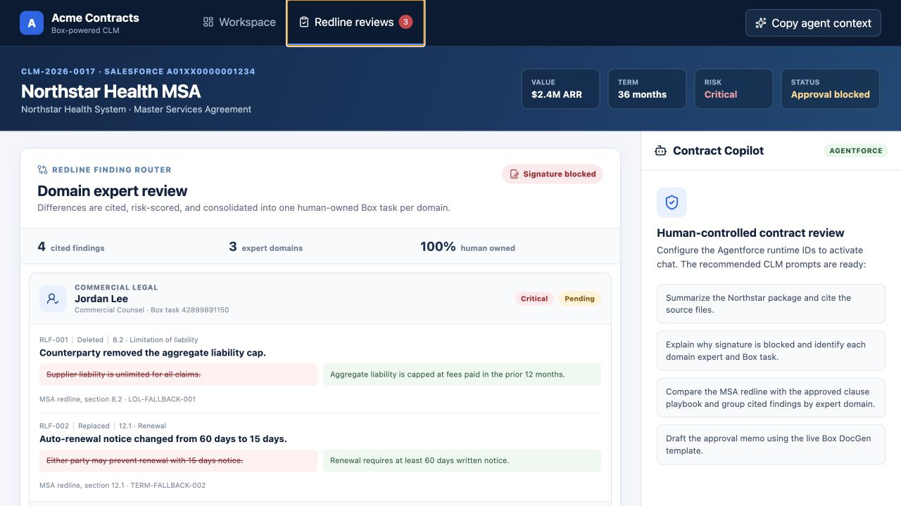
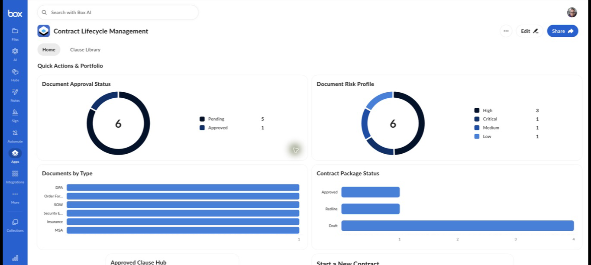
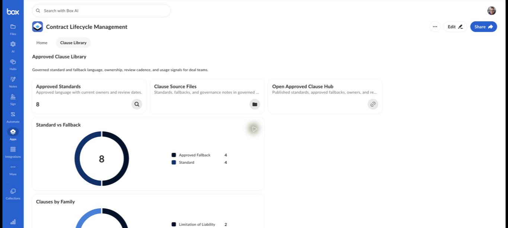

# Agentic Orchestration

Supervisor-led CLM execution across the complete platform stack. AWS Bedrock AgentCore and Strands coordinate specialist agents across Box, Agentforce, Salesforce, the Multi-Framework React workspace, and Databricks while humans retain approval and signature authority.

## Read this guide in order

[1. Orientation](#1-orientation) → [2. Architecture](#2-architecture) → [3. Flow](#3-flow) → [4. Presenter script](#4-presenter-script) → [5. Visual walkthrough](#5-visual-walkthrough) → [6. Components and readiness](#6-components-and-readiness) → [7. Setup and validation](#7-setup-and-validation)

Everything required for the main presentation is on this page. Links in **References** and the supporting React scripts are optional technical depth.

## 1. Orientation

Use this track when dynamic planning, specialist delegation, memory, traces, and cross-system reasoning are central and the Salesforce React workspace is the presenter surface.

| Boundary | Included |
|---|---|
| Presenter surface | Salesforce Multi-Framework React CLM workspace |
| Orchestration | AWS Bedrock AgentCore supervisor and Strands specialists |
| Systems | Box, Agentforce, Salesforce, Databricks |
| Shared asset | Box Automate intake exists but remains inactive and is not executed in this presenter path |
| Human authority | Legal positions, approvals, concessions, signature, final obligations |

Current truth: the React experience and Box surfaces are available; the AgentCore flow is represented by a deterministic local trace. Do not present managed AWS or Databricks screens as live until deployed and captured.

[Continue to architecture](#2-architecture)

## 2. Architecture

AgentCore/Strands owns planning and specialist delegation. Box governs content, Salesforce governs structured commercial context, Agentforce provides Salesforce-native assistance and actions, Databricks supplies analytical context, and React presents the joined workspace.

- [Architecture source](../../diagrams/clm-agentcore-architecture.mmd)
- [Shared architecture and control detail](../../01-architecture.md)

[Continue to flow](#3-flow)

## 3. Flow

1. A Box or Salesforce event starts an AgentCore session.
2. The supervisor selects Box, Salesforce/Agentforce, and Databricks specialists.
3. Specialists return governed evidence, structured commercial truth, and historical benchmarks.
4. React presents the combined context, citations, findings, and ownership.
5. A human gate blocks signature and routes missing approvals.
6. Approved work proceeds to Doc Gen, Box Sign, obligations, and audit evidence.

- [Flow source](../../diagrams/agentic-orchestration-flow.mmd)

[Continue to presenter script](#4-presenter-script)

## 4. Presenter script

**Duration:** 20–25 minutes

**Audience:** Executives, enterprise architects, AI platform teams, and technical buyers

1. **Enter through the CLM dashboard or event.** The intake event gives the supervisor contract, workspace, and requester context.
2. **Start the AgentCore session.** Show the Strands supervisor creating a trace and deciding which specialists are required.
3. **Validate governed content.** The Box package agent checks files, metadata, versions, approved clauses, and missing evidence.
4. **Compare structured truth.** The Salesforce commercial agent flags Net 90 in the order form against Net 45 in the record.
5. **Analyze redlines.** The clause-risk specialist produces cited liability, PHI, SLA, renewal, and termination findings.
6. **Add portfolio intelligence.** The Databricks agent returns governed historical outcomes and cycle-time benchmarks without overwriting the contract record.
7. **Route human experts.** The approval specialist groups findings into Legal, Finance, Privacy, and Security work.
8. **Work in Salesforce React.** Show the Northstar workspace, Box context, cited findings, and Agentforce conversation in one surface.
9. **Demonstrate the guardrail.** A premature signature request is blocked until required approvals are complete.
10. **Complete the lifecycle.** After confirmation, generate the packet, execute through Box Sign, extract obligations, and return state to Box and Salesforce.

Required language: AgentCore/Strands coordinates; Agentforce supplies Salesforce-native capabilities; Box governs content; Databricks supplies analytics, not authority; humans approve concessions, signatures, and final obligations.

[Continue to the visual walkthrough](#5-visual-walkthrough)

## 5. Visual walkthrough

The Box screenshots below reference the Governed Workflow source files. Only the React screenshots are scenario-specific.

### Unified React workspace

### Shared governed Box context

Optional offline presentation: [self-contained gallery](../../../output/html/agentic-orchestration-gallery.html). No live Databricks or AWS console screenshots are claimed; use the architecture, flow, and [local trace](../../../output/agentcore/northstar-agentcore-trace.json) until managed deployment is verified.

[Continue to components and readiness](#6-components-and-readiness)

## 6. Components and readiness

| Layer | Components | Status |
|---|---|---|
| Experience | Salesforce Multi-Framework React CLM workspace | Local verified |
| Salesforce | `CLM_Contract__c`, Agentforce Contract Copilot, approval context | Object/integration deployed; agent specification not deployed |
| Box | Apps, Forms, content, metadata, tasks, Hub, Doc Gen, Sign | Core surfaces live; Automate inactive |
| Orchestration | AWS Bedrock AgentCore supervisor and Strands specialists | Specification and deterministic local mock |
| Analytics | Databricks historical outcomes and cycle-time benchmarks | Synthetic dataset/tool contract only |
| Controls | Citations, deterministic expert directory, human approvals, signature block | Specified; Box tasks seeded |
| Observability | Handoffs, tool calls, guardrail events, final trace | Local trace generated |

[Continue to setup and validation](#7-setup-and-validation)

## 7. Setup and validation

1. Run `python3 scripts/run_agentcore_mock.py` and validate `output/agentcore/northstar-agentcore-trace.json`.
2. Start the React workspace with `recordId`, `contractId=CLM-2026-0017`, and `folderId=399081692991`.
3. Confirm Box content and the safe Agentforce fallback render without browser secrets.
4. Confirm the trace shows Box, Salesforce/Agentforce, and Databricks specialist work plus a signature-block guardrail.
5. Confirm every finding has a Box citation and every approval remains human-owned.
6. Describe AgentCore and Databricks as local/specification-backed until managed deployment tests pass.

### References

- [Detailed AgentCore runbook](../../runbooks/03-agentcore-demo.md)
- [Full setup and activation](../../runbooks/05-demo-setup-and-activation.md)
- [Manual-task register](../../manual-task-register.md)
- [Machine-readable scenario manifest](../../../config/demo/agentic-orchestration-demo-manifest.json)
- [Supporting React scripts](supporting-react-scripts/README.md)

[Back to the scenario selector](../README.md)
