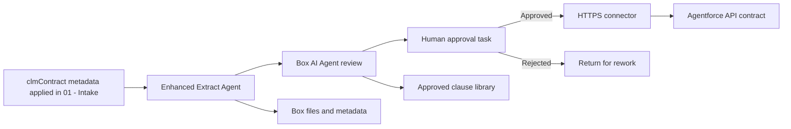

# Architecture: Box + Agentforce + React for CLM

## Design Principles

1. **One content foundation** - Box stores contract documents, signatures, metadata, versions, and audit trail.
2. **One presenter path** - Box + Salesforce Contract Lifecycle presents the React workspace and Agentforce over the governed Box foundation.
3. **Human accountability** - AI drafts, summarizes, compares, extracts, and recommends. Humans approve legal positions, concessions, signatures, and obligations.
4. **Composable integrations** - Box is the system of record for unstructured content, Salesforce for structured deal data, and each domain system for its own governed analytics context.
5. **Reusable demo factory** - Domain demos reuse the same abstraction layers, metadata conventions, agent patterns, and handoff workflow.

---

## Box Content and Automation Layer

### Box Objects

| Object | Purpose |
|--------|---------|
| `Contract Requests` folder | Intake packages entering via the `clmContract` metadata trigger |
| `Active Negotiations` folder | Live CLM workspaces by counterparty |
| `Executed Agreements` folder | Signed agreements with retention and renewal metadata |
| `Clause Library` folder | Approved standard clauses and fallback positions |
| `Obligation Register` folder/view | Post-signature deliverables, renewal events, notices, and owner assignments |
| `Acme Contract Clause Library` Hub | Curated publication surface for approved clause Markdown files and governance guidance |

### Metadata Templates

| Template | Scope | Example Fields |
|----------|-------|----------------|
| `clmContract` | Contract folder/package | contractId, counterparty, contractType, status, dealValue, region, owner, legalReviewer, riskLevel, renewalDate |
| `clmDocument` | Files | documentType, versionStatus, clauseRisk, aiSummaryStatus, approvalStatus, signatureStatus |
| `clmObligation` | Obligation files/records | obligationType, owner, dueDate, sourceClause, noticePeriod, status |
| `clmClause` | Individual Markdown clauses | clauseId, category, position, status, owner, reviewDate, usageCount |

### Native Automate Flow



Extract and AI outputs remain draft evidence. The approval task is the control point before the connector invokes Salesforce standard REST. Bind the Salesforce origin, API version, OAuth 2.0 connection, and payload mapping to the confirmed target org; do not invent them.

---

## Scenario: Box + Salesforce Contract Lifecycle

Two platforms, one set of governed actions between them. Box holds contract content; Salesforce holds structured commercial truth and every path from one to the other.

Rendered diagram: [CLM Architecture](../diagrams/clm-architecture.svg)

Source: [Mermaid diagram](../diagrams/clm-architecture.mmd)

```text
┌────────────────────────────────────────────────────────────────────────────┐
│                    Salesforce - governed Apex actions                      │
│                                                                            │
│  ┌────────────┐ ┌────────────┐ ┌────────────┐ ┌───────────────────────┐    │
│  │ Contract   │ │ Ask a      │ │ Generate   │ │ Send for signature    │    │
│  │ package    │ │ document   │ │ memo       │ │ (state-gated)         │    │
│  └─────┬──────┘ └─────┬──────┘ └─────┬──────┘ └───────────┬───────────┘    │
│        │              │              │                    │                │
│  ┌─────┴──────────────┴──────────────┴────────────────────┴────────────┐   │
│  │      Client Credentials Grant - the Box token never leaves Apex     │   │
│  └─────────────────────────────────────────────────────────────────────┘   │
└────────────────────────────────────────────────────────────────────────────┘
        ▲                                                        ▲
        │ MCP / Agentforce (internal)      downscoped token (counterparty)
```

### System Roles

| System | Data Type | Access Pattern |
|--------|-----------|----------------|
| Box | Contracts, redlines, exhibits, signatures, clause library | MCP/API read-write with metadata and events |
| Salesforce | Opportunity, account, quote, approval state, renewal date | API read-write with event triggers |
| Box audit trail | File versions, metadata changes, task and comment history | Append-only observability |

---

## Event-Driven Flow

```text
Box metadata trigger / Salesforce Opportunity Event
        │
        ▼
Intake
        │
        ├──► Box: create workspace, apply metadata, collect package
        ├──► Salesforce: read opportunity, quote, account risk
        │
        ▼
Clause Risk Agent
        │
        ├──► Compare redlines to playbook
        ├──► Score clause risk
        └──► Draft fallback position
        │
        ▼
Approval Agent
        │
        ├──► Route approvals to legal, privacy, security, finance
        └──► Block execution until required approvals complete
        │
        ▼
Box Sign + Obligation Monitor
```

---

## Abstraction Layers for Faster Demo Creation

| Layer | Reusable Contract | CLM Example | DAM / Vertical Swap |
|-------|-------------------|-------------|---------------------|
| Demo scenario | Persona, business object, high-stakes workflow | Commercial contract package | Asset campaign, government case file, claim, loan, portfolio review |
| Content schema | Folder template + metadata templates | Contract workspace, documents, obligations | Asset library, evidence packet, policy, loan docs |
| Scenario model | Workflow-directed or supervisor-directed agentic orchestration | Box Automate-led path or cross-platform supervisor path | Preserve the same two-track distinction |
| Agent roles | Intake, classify, risk, approve, monitor | Contract intake, clause risk, approval, obligations | Rename to domain-specific roles |
| System connectors | Content, CRM | Box, Salesforce | Box plus domain systems |
| Sample data | Synthetic PDFs + JSON records | MSA/DPA/SOW/order form | Domain-specific records and files |
| Runtime state | Gitignored environment and bootstrap bindings | Box App, metadata, agents | Same portable binding contract |

---

## Failure Handling

| Scenario | Recovery Strategy |
|----------|-------------------|
| Missing contract package document | Intake agent creates task for requester and pauses downstream review |
| Low-confidence clause extraction | Escalate to legal reviewer with source page reference |
| Conflicting CRM and contract values | Block signature and route to sales operations |
| Approval timeout | Escalate to owner and update dashboard SLA status |
| Box Sign failure | Retry and create manual signature fallback task |
| Agent output conflicts with playbook | Guardrail blocks recommendation and asks for human legal review |

---

## Box Entry-Point Path

The metadata-triggered intake that opens the scenario. Automate owns the intake sequence, agents enrich individual steps, humans own approvals; the React workspace opens on the record it creates.

Canonical module: [Entry-Point Variation: Box Metadata Trigger to Salesforce Record](../operator/scenarios/box-salesforce-clm/supporting-react-scripts/04-box-metadata-automate-entry.md)

Flow: [rendered](../diagrams/clm-box-metadata-automate-entry.svg) · [source](../diagrams/clm-box-metadata-automate-entry.mmd)

### Entry-point rules

| Rule | Implementation |
|---|---|
| Box remains authoritative | Live Box workspace, file, metadata, clause, and task IDs anchor the workflow; agents cite Box sources. |
| Salesforce record creation is governed | Only validated intake reaches the standard REST external-ID upsert and lookup. |
| Agentforce does not decide | Legal positions, approvals, and signature authorization remain human actions. |
| Routing is deterministic | Domains resolve through `config/clm/expert-routing.json`; low-confidence, unclassified, inaccessible, and unconfigured assignments go to Legal Operations triage. |
| Tasks are consolidated | The routing action creates or reuses one open task per contract, redline file, and domain. |
| Mutations are explicit | DocGen file creation requires presenter confirmation; signing stays blocked until approvals complete. |
| No external agent runtime in intake | Intake itself sends no request to an external agent runtime or custom middleware. |

Workflow contract: [`config/box/automate-workflows.json`](../../config/box/automate-workflows.bcl)

Agent contract: [`config/agentforce/clm-react-agentforce-spec.json`](../../config/agentforce/clm-react-agentforce-spec.bcl)

---

## Monitoring

| Signal | Target |
|--------|--------|
| Intake-to-workspace creation time | Under 2 minutes |
| Clause extraction confidence | 85%+ for standard agreements |
| Approval SLA breach rate | Under 10% |
| Time in legal review | 30-50% reduction after adoption |
| Contract cycle time | 20-40% reduction for standard commercial agreements |
| Metadata completeness | 95%+ for executed agreements |
| Obligation extraction coverage | 90%+ of signed contracts |
